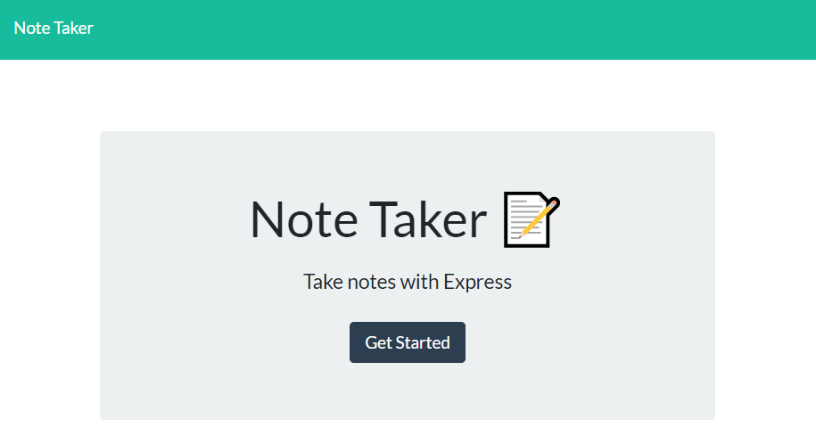
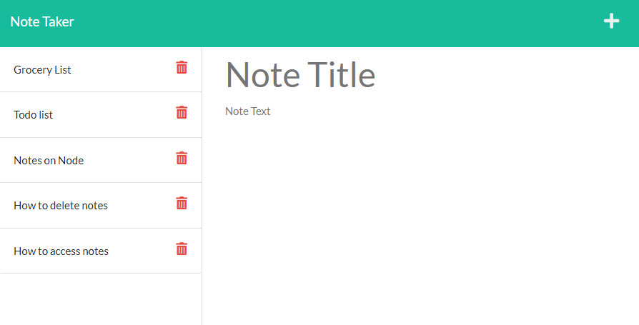

# Note Taker

[Live link to application](https://ancient-sea-45779.herokuapp.com/)

## Features

```
    This application allows users to take notes and store them in a json database
    Users can save a note after entering a title and description and clicking on the save icon
    Users can access saved notes by clicking on the title on the left-hand side of the screen
    Users can delete any notes by clicking on the trash can icon

```

## Home Page



## Notes Page


